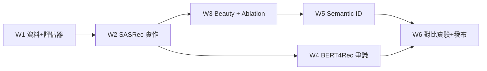

# Sequential Rec 專案 — 詳細執行計畫(Execution Plan)

> 本文件是 [`sequential-rec-project-plan.md`](sequential-rec-project-plan.md) 的可執行展開版。
> 原計畫定義「做什麼、為什麼」;本文件定義「怎麼做、按什麼順序、做完怎麼驗收」。
> 使用方式:每完成一項勾掉 checkbox;每週結束對照「驗收標準」決定是否進入下一週。

**時程:** 6 週,每週 12–15 小時
**追蹤:** 所有實驗記入 MLflow(config + metrics + git hash);對齊過程記入 `REPRODUCTION_LOG.md`

---

## 總覽:里程碑與依賴關係



| # | 里程碑 | 週 | 硬性驗收標準(不達標不往下走) |
|---|---|---|---|
| M1 | 評估器凍結 | W1 | 評估器單元測試全綠;Pop / BPR-MF baseline 數字入 MLflow |
| M2 | SASRec 達標 | W2 | ML-1M sampled HR@10 ∈ [0.80, 0.83]、NDCG@10 ∈ [0.57, 0.60] |
| M3 | Ablation 完成 | W3 | 4 組 ablation 進 master table;Beauty HR@10 接近 0.4854 |
| M4 | 爭議驗證 | W4 | 招牌訓練曲線圖產出;RecBole SASRec 與自實作差 < 2% |
| M5 | Semantic ID 可用 | W5 | RQ-KMeans 3×256 codes 完成;constrained decoding 只產合法 item |
| M6 | 發布 | W6 | cold-start 分桶結果;README 對照表;Medium 初稿 |

---

## Week 0(開工前,約 2 小時):一次性準備

- [ ] 建 GitHub repo `sequential-rec-from-sasrec-to-tiger`(public)
- [ ] 初始化骨架(結構照原計畫附錄 A):
  ```bash
  uv init --python 3.11
  uv add torch numpy pandas scipy tqdm pyyaml mlflow
  uv add --dev pytest black ruff pre-commit
  pre-commit install
  mkdir -p configs src/{data,models,semantic_ids,eval} notebooks serving docs results/{figures,tables} tests
  touch README.md REPRODUCTION_LOG.md
  ```
- [ ] 確認硬體:有 GPU(本機 MPS / Colab / 雲端)並跑通 `torch` device 檢查
- [ ] 下載論文 1、3(SASRec、Krichene & Rendle),W1 通勤/零碎時間精讀

---

## Phase 1:SASRec 復現(Week 1–3)

### Week 1 — Data Pipeline 與評估框架(先評估、後模型)

**原則:評估協定是最大變因,本週結束後凍結,之後任何模型都用同一套評估器。**

#### Day 1–2:資料 pipeline(約 4h)
- [ ] `src/data/download.py`:下載 MovieLens-1M(自動下載 + md5 檢查)
- [ ] `src/data/preprocess.py`:
  - [ ] rating 全轉 implicit 正樣本
  - [ ] 5-core filtering(迭代過濾至收斂,user/item 均 ≥ 5)
  - [ ] 按 user 分組、timestamp 排序
  - [ ] Leave-one-out split:最後一個 → test、倒數第二 → valid、其餘 → train
  - [ ] 產出統計數字並與論文對照:ML-1M 應約 6040 users / 3416 items / 平均序列長 ~165
- [ ] `src/data/dataset.py`:PyTorch Dataset,maxlen=200、左側 padding(padding id = 0)

**驗收:** 統計數字與論文 Table 1 相符(±1%);split 無洩漏(test item 不在該 user 的 train 序列中,寫一個 assert 驗證)。

#### Day 3–4:雙軌評估器(約 4h)
- [ ] `src/eval/sampled.py`:1 正樣本 + 100 uniform random negatives(排除該 user 歷史互動),HR@10 / NDCG@10;**negative 抽樣固定 seed**,存成檔案讓所有模型共用同一組 negatives
- [ ] `src/eval/full_ranking.py`:全 catalog 排序、排除已互動 item,同指標
- [ ] `tests/test_eval.py`:手工構造 3-user toy dataset,人工算出期望 HR/NDCG,pytest 驗證兩個評估器
- [ ] README 草稿加一段:sampled metrics 偏差問題(Krichene & Rendle 2020)

**驗收:** `pytest tests/` 全綠;同一組隨機分數輸入,兩評估器行為符合手算。

#### Day 5–7:Baselines + MLflow(約 5h)
- [ ] Popularity baseline(全域 top-K)→ 兩種協定各跑一次
- [ ] BPR-MF:用 `implicit` 套件(`uv add implicit`),不自己寫
- [ ] 跑一次參考實作(擇一):SASRec 官方 repo 或 RecBole,把 ML-1M 數字記入 `REPRODUCTION_LOG.md` 作為 W2 三角驗證基準
- [ ] MLflow tracking:`src/train.py` 的骨架先建好 — 讀 yaml config、log params/metrics/git hash

**Week 1 產出檢查:** ✅ pipeline ✅ 測試過的雙評估器 ✅ 2 個 baseline 數字 ✅ 參考實作數字 ✅ MLflow 就緒

---

### Week 2 — SASRec from scratch

#### Day 1–3:模型實作(約 6h)
`src/models/sasrec.py`,嚴格對照 Kang & McAuley (2018):

- [ ] Item embedding(d=50)+ **learnable** positional embedding
- [ ] 2 × self-attention block:causal mask、1 head → point-wise FFN(兩層 Conv1D/Linear + ReLU)→ residual + LayerNorm + dropout(0.2)
- [ ] 輸出層 **共享 item embedding 權重**(score = hidden · emb^T)
- [ ] 訓練:每位置預測 next item、BCE、每正樣本 1 個 random negative、padding 位置 loss 排除
- [ ] Config:`configs/sasrec_ml1m.yaml`(maxlen 200 / d 50 / blocks 2 / heads 1 / dropout 0.2 / Adam lr 1e-3 β2 0.98 / batch 128 / max epochs 200 / 早停 patience 20 on valid NDCG@10)

**實作自查清單(對照原計畫「常見坑」,寫成 assert 或小測試):**
- [ ] causal mask 方向:位置 i 只能看 ≤ i(寫測試:改動未來 token 不影響位置 i 輸出)
- [ ] padding 位置被 attention mask 掉
- [ ] 評估 negatives 不含 user 訓練 item(W1 已固定的 negative 檔天然保證)
- [ ] positional index 不超界

#### Day 4–5:訓練與 debug(約 4h)
- [ ] 先跑小規模 sanity:100 users 子集,確認能 overfit(train loss → 0)
- [ ] 全量訓練;每 epoch 記 valid sampled NDCG@10 進 MLflow
- [ ] 每次 debug 嘗試(假設 → 改動 → 結果)記入 `REPRODUCTION_LOG.md`

#### Day 6–7:對齊論文(約 4h)
- [ ] 目標:HR@10 ∈ [0.80, 0.83]、NDCG@10 ∈ [0.57, 0.60](sampled)
- [ ] 若差 > 2pp,按序檢查:① 評估協定 ② negative sampling ③ 早停時機 ④ dropout
- [ ] 三角驗證:論文 vs 官方 repo(W1 記錄)vs 自實作,結論寫入 log

**Week 2 產出檢查:** ✅ M2 達標 ✅ REPRODUCTION_LOG.md 有完整對齊紀錄

---

### Week 3 — Amazon Beauty + Ablation

#### Day 1–2:Beauty pipeline(約 3h)
- [ ] 下載 Amazon Review(Beauty, 5-core);複用 preprocess(參數化 maxlen)
- [ ] `configs/sasrec_beauty.yaml`:maxlen 50、hidden dim 試 50 與 64
- [ ] 目標參考:sampled HR@10 ≈ 0.4854(±2pp 接受)

#### Day 3–5:4 組 ablation(約 6h,可並行排隊訓練)
每組一個 config、一個 MLflow run tag:
- [ ] **A1 Positional embedding:** learnable / 無 / sinusoidal(ML-1M)
- [ ] **A2 maxlen:** 50 / 100 / 200 — 記指標 + 每 epoch 訓練時間
- [ ] **A3 Sampled vs full ranking:** 對每個已存 checkpoint 各算兩種指標 → scatter plot(`results/figures/sampled_vs_full.png`)
- [ ] **A4 訓練 negative sampling:** uniform vs popularity-based

#### Day 6–7:整理(約 3h)
- [ ] Master table:所有實驗 → `results/tables/master.md`(從 MLflow 匯出腳本化,別手抄)
- [ ] 圖:訓練曲線、各 ablation 對照圖 → `results/figures/`

**Week 3 產出檢查:** ✅ 兩 dataset 完整結果 ✅ 4 組 ablation ✅ master table + 圖

---

## Phase 2:BERT4Rec 爭議驗證(Week 4)

**策略:不從零實作 BERT4Rec,用 RecBole;火力集中在「訓練預算控制下的公平比較」。**

#### Day 1–2:文獻與設定(約 3h)
- [ ] 精讀 Petrov & Macdonald (2022);摘出可驗證的具體 claims(3–5 條)寫進 `docs/bert4rec-controversy.md` 開頭
- [ ] RecBole 安裝與 BERT4Rec 設定:mask ratio 0.2、**評估協定與自家 SASRec 完全一致**(同 split、同 negatives 檔、同指標)— 必要時把 RecBole 的預測分數導出,用自家評估器算分,確保協定一致

#### Day 3–5:核心實驗(約 6h,大多是等訓練)
- [ ] BERT4Rec:原論文預設 epochs / 4x / 10x 三組
- [ ] SASRec(自實作)同樣延長訓練對照
- [ ] RecBole SASRec 交叉驗證:與自實作相對差 < 2% → 寫入 log 作為正確性第三方證據
- [ ] **招牌圖:** x = 訓練時間(wall-clock 與 epochs 各一版),y = NDCG@10,兩模型多曲線 → `results/figures/training_budget.png`

#### Day 6–7:分析寫作(約 3h)
- [ ] `docs/bert4rec-controversy.md`:逐條回應 Day 1 列的 claims — 支持/不支持/不確定,附數據
- [ ] 誠實原則:結果與文獻不一致就照實寫並分析原因

**Week 4 產出檢查:** ✅ 招牌圖 ✅ 交叉驗證 < 2% ✅ 爭議分析文件

---

## Phase 3:TIGER-style 生成式推薦(Week 5–6)

### Week 5 — Semantic ID 構建 + 模型改造

#### Day 1–2:Content embedding(約 3h)
- [x] `uv add sentence-transformers`;`src/semantic_ids/embed.py`
- [x] ML-1M:title + genres;Beauty:title + category + brand → `all-MiniLM-L6-v2` → 384-dim(metadata 覆蓋率兩邊皆 100%)
- [x] 存 item_id → embedding lookup(`data/processed/*/semantic_ids/embeddings.npz`;另補回 preprocess 從未存下的 `id_maps.json`)

#### Day 3–4:量化(約 4h)
- [x] **v1 RQ-KMeans(必做):** `src/semantic_ids/rq_kmeans.py` — 3 levels × 256 codes,逐層對 residual 跑 KMeans
- [x] 碰撞處理:同 3-level code 的 items 加第 4 個 disambiguation token(ML-1M 1.46% / Beauty 11.78%)
- [x] 品質 spot check:`scripts/inspect_semantic_ids.py` → `results/tables/semantic_ids_*.md`(另加 within-prefix cosine 的量化指標)
- [x] 統計:碰撞率、各層 code 使用分布 → 兩個資料集皆 0 dead codes,記入 log
- [~] **v2 RQ-VAE(stretch):跳過** — 0 dead codes,沒有 collapse 可修

#### Day 5–7:生成式模型(約 6h,本週最難)
- [x] `src/models/genrec.py`:輸入序列改為 semantic ID token 序列(每 item 4 tokens);**刻意沿用 SASRec 骨幹**,讓 Week 6 的唯一變因是 item 表示法
- [x] Decoder autoregressive 生成 next item 的 4 codes;另實作 `score_item_tokens` 讓既有 sampled evaluator 可直接沿用
- [x] **分兩步降風險(對應附錄 C 備案):**
  - [x] Step 1:greedy decoding + 事後過濾非法 item — 端到端跑通,並量到 legal rate
  - [x] Step 2:`src/beam_search.py` — Trie constrained beam search(向量化,beam 預設 20)
  - [x] 測試:任意 decode 結果必為合法 item;另 assert beam 分數 == 直接 scoring、beam 夠寬時 == 窮舉最佳

**Week 5 產出檢查:** ✅ semantic IDs + 品質檢查 ✅ 生成式模型跑通 ✅ constrained decoding 正確

---

### Week 6 — 對比實驗 + 包裝發布

#### Day 1–3:核心對比(約 6h)
- [x] **主實驗:** SASRec (atomic) vs GenRec (semantic),Beauty,full ranking — GenRec 0.0329 vs SASRec 0.0594(−44.6%);未達 TIGER 參考 0.0648,差異與限制照實記錄
- [x] **Cold-start 分桶(招牌之二):** `src/eval/cold_start.py` + `results/figures/cold_start_buckets.png` — **假說反向失敗**:越稀有差距越大(tail −88.2%)
- [x] 預期管理:實際是大輸,並診斷出機制(推薦多樣性塌縮:7% vs 76% catalogue coverage)

#### Day 4–5:Serving demo + README(約 4h)
- [ ] `serving/app.py`:FastAPI — 輸入互動序列 → top-10 推薦,附 semantic ID 解碼展示
- [ ] README 重寫:復現對照表置頂 → 方法論(評估協定討論)→ 招牌兩圖 → 限制誠實列出 → 復現指令(`uv run ...` 一鍵)
- [ ] (Optional)Railway 部署

#### Day 6–7:Medium 文章(約 4h)
- [ ] 結構:為什麼復現 → SASRec 對齊與坑 → BERT4Rec 爭議圖 → Semantic ID 改造 → cold-start 發現 → 給後人的 checklist
- [ ] LinkedIn 短文版
- [ ] 面試話術包:附錄 D 一句話 + L1/L2/L3 問答各寫 3 題自問自答,存 `docs/interview-prep.md`

**Week 6 產出檢查:** ✅ 主實驗 + cold-start 結果 ✅ demo ✅ README ✅ Medium 初稿

---

## 橫貫全程的工作習慣

1. **每個實驗 = 一個 yaml config + 一個 MLflow run**,不改 code 跑實驗;結果表用腳本從 MLflow 匯出。
2. **REPRODUCTION_LOG.md 即時寫**,格式:`日期 / 假設 / 改動 / 結果 / 下一步` — 這是 Medium 文章的原始素材。
3. **每週日花 15 分鐘對照本文件的「產出檢查」**,沒過就啟動附錄 C 砍序:RQ-VAE → Railway 部署 →(極端時)A4 ablation。
4. **評估器 W1 之後凍結**;任何評估 bug 修復都要 re-run 全部受影響實驗並在 log 註記。
5. **Commit 紀律:** 每個可運行的里程碑一個 commit,MLflow 記 git hash,實驗可追溯到 code 版本。

## 風險觸發點(何時啟動備案)

| 觸發訊號 | 時點 | 行動 |
|---|---|---|
| W2 Day 7 仍差 > 2pp | W2 末 | 接受並詳細記錄差距分析,不無限對齊;W3 照走 |
| RQ-VAE 調 > 4h 未收斂 | W5 Day 4 | 放棄 v2,RQ-KMeans 定案 |
| Trie beam search W5 Day 7 未通 | W5 末 | 用 greedy+過濾版跑 W6 實驗,Trie 列 future work |
| W5 開始時 W4 未完 | W5 初 | W4 Day 6–7 寫作延到 W6,Phase 3 優先(訓練可背景跑) |
| 總進度落後 > 1 週 | 任何時候 | 砍到 Phase 1+2 完整發布,Phase 3 作為 repo 的 branch/future work |
