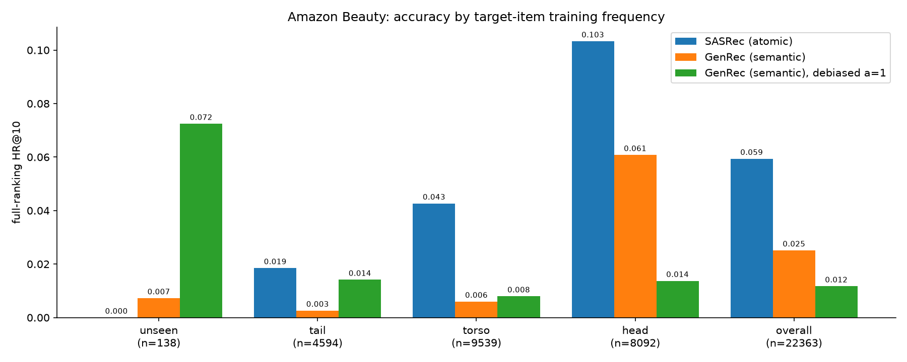

# From SASRec to TIGER

[](https://github.com/jeannineshiu/sequential-rec-from-sasrec-to-tiger/actions/workflows/ci.yml)


A controlled study of sequential recommendation, from the 2018 self-attentive baseline to a
generative retriever that emits items as sequences of quantized semantic tokens — one codebase, one
evaluation harness, one set of frozen negatives, so that every number on this page is differenced
against something measured the same way.

The repo has two deliverables. The first is a **faithful, verified SASRec reproduction** on
MovieLens-1M and Amazon Beauty. The second is a **generative recommender built on the same
backbone**, where items are emitted as sequences of semantic tokens rather than looked up in an
embedding table — and a measurement of exactly what that representation buys and what it costs.

**What the second deliverable is, precisely.** It tests *semantic IDs as an item representation*,
under a single-variable ablation. It is not a TIGER reproduction. TIGER pairs semantic IDs with a T5
encoder–decoder, an RQ-VAE quantizer, and a user token; none of those are here. The generative model
runs on SASRec's own transformer stack, and that is the point: swapping the backbone *and* the item
representation at once would produce exactly the kind of comparison this repo exists to document —
one where the measured effect belongs to something nobody chose to test. Holding the backbone fixed
is what makes "atomic vs. semantic ID" a clean single variable. RQ-VAE was skipped on measured
evidence rather than on budget: residual K-Means produces **zero dead codes on both datasets**
([below](#semantic-id-quality)), so the codebook-collapse failure mode RQ-VAE exists to fix does not
arise here. That is a finding, not a shortcut. The title names the direction of travel; the
experiments are on the item representation.

Both are evaluated under two protocols side by side (sampled and full-catalog ranking), against a
measured seed-noise floor, with negative and mixed results reported as they came out.

---

## Key findings

**1. A framework's default hyperparameter outweighed the architectural effect it was used to
demonstrate.** RecBole's SASRec and BERT4Rec configs are identical on every architectural default
except dropout (0.5 vs 0.2). Aligning that single line moves the SASRec–BERT4Rec comparison by
+3.71% HR@10 / +6.33% NDCG@10 — larger than the entire margin the comparison was meant to explain,
and enough to flip the winner. Same BERT4Rec run, three conclusions. This puts the *premise* of the
BERT4Rec controversy in question rather than settling it: the budget claim at its centre is
[untested here](#the-dropout-default).

**2. Agreement under the sampled protocol is not agreement.** Two SASRec implementations that match
to +0.61% on sampled HR@10 diverge by **+40% HR@10 / +53% NDCG@10** under full-catalog ranking. Any
model selection done on the sampled protocol alone is selecting on a metric that does not preserve
ordering.

**3. Most of that divergence is the training objective, and the sampled protocol is blind to it.**
A loss-only ablation — full-catalog softmax instead of BCE against one sampled negative, nothing
else touched — recovers **+22.54% full HR@10 / +32.29% full NDCG@10**, accounting for 56% and 60%
of the cross-framework gap. On sampled HR@10 the same change measures **−0.38%, inside seed noise**.
The objective is worth a fifth of the full-ranking score and is invisible to the protocol the
original paper evaluated with.

**4. Semantic IDs trade accuracy for compression and reach, not for accuracy.** On Beauty, the
generative model reaches 71% of SASRec's sampled HR@10 while running on **13.7% of the parameters**
(12,101 item embeddings collapse into 782 token embeddings). It also retrieves items that are
structurally unreachable for an atomic embedding table: on items never seen in training, 7.25%
HR@10 against SASRec's 0.00% (Fisher exact, one-sided *p* = 0.0008) — **but only with popularity
debiasing applied at ranking time**. As trained it is 1 hit in 138 (0.72%, *p* = 0.50), and the
debiasing that buys those 10 hits costs 80% of overall accuracy. The reach is real and it is not
free; the full ledger is in the cold-start section. On
[ML-1M](#the-same-comparison-on-ml-1m--the-dense-regime) the accuracy verdict repeats — −53.0%
full HR@10 against Beauty's −57.7% — but the compression does not: **51.8%** of the parameters
there, not 13.7%, because a 3,416-item table was never what cost anything. The saving scales with
the catalog, not with the method.

**5. Swapping item representations silently swaps scoring rules — and that is where the damage
is.** A generative model ranks by `P(item | history)`, which carries a popularity prior; a dot
product does not. Constrained beam search compounds it: beam-20 reports HR@10 0.0407 where
exhaustive scoring gives 0.0240, because the mean true rank of a beam-reported hit is 167. Both
effects arrived with the architecture, uninvited, in the same way the dropout default arrived with
the framework.

**6. The generative model's deficit is not localized to one repairable stage.** Handing it the
target's true first semantic code multiplies HR@10 by 12.4x — and still leaves **69% of targets
outside the top 10 with a median of 51 candidates remaining**. Its level-1 prediction is not lost
either (median rank 26 of 256 against 128 for chance). An earlier reading of this repo's per-level
accuracies called the first code the binding constraint; measured in retrieval terms it is
expensive but not binding, and no better decoder recovers the rest.

---

## What's in the repo

| Component | Path | Notes |
|---|---|---|
| SASRec | `src/models/sasrec.py` | From-scratch PyTorch; causal self-attention, BCE against one sampled negative per position, per Kang & McAuley (2018) |
| GenRec (TIGER-style) | `src/models/genrec.py` | Same backbone, decoder over semantic tokens; constrained (Trie) decoding, KV-cached |
| Semantic ID construction | `src/semantic_ids/` | Item text → `all-MiniLM-L6-v2` → residual K-Means, 3×256 codes + a disambiguation token |
| Baselines | `src/baselines.py` | Popularity, BPR-MF (`implicit`) |
| Evaluation | `src/eval/` | Sampled (1+100), full-catalog, cold-start bucketing, generative scoring |
| Cross-framework runs | `src/recbole_run.py`, `scripts/rescore_recbole.py` | RecBole SASRec/BERT4Rec + offline rescoring onto this repo's frozen negatives |
| Analysis | `scripts/` | Seed variance, ablations, atomic-vs-semantic, decoding diagnostics, popularity debiasing |
| Serving demo | `serving/app.py` | FastAPI; both models side by side with decoded semantic IDs |
| Remote GPU orchestration | `scripts/daytona_*.py` | Detached, host-independent sweeps with result recovery |

Datasets after 5-core filtering and leave-one-out splitting: **ML-1M** — 6,040 users / 3,416 items;
**Amazon Beauty** — 22,363 users / 12,101 items.

---

## Evaluation protocol

Everything below follows the same three rules; deviations are marked at the point of use.

- **Two protocols, always reported together.** The *sampled* protocol (1 positive + 100 uniform
  negatives) matches the original SASRec paper. The *full* protocol ranks against the entire
  catalog excluding history. Sampled metrics are known to be non-order-preserving
  (Krichene & Rendle, 2020) and this repo measures how badly, rather than citing it.
- **Frozen negatives.** `data/processed/*/negatives.json` is drawn once (seed 42) and reused by
  every model. *Exception:* RecBole's evaluator draws its own `uni100` sample. That is not a
  hand-wave — rescoring identical predictions both ways puts the effect at +2.28% HR@10 / +5.38%
  NDCG@10, the same order as the margins under discussion, so rows from different draws are never
  differenced against each other.
- **Leave-one-out split**, 5-core filtered, per user: last item → test, second-to-last → valid, rest
  → train. Absence of leakage is asserted at preprocessing time.

---

## Results

### SASRec reproduction — ML-1M, sampled protocol, test, k=10

| Model | HR@10 | NDCG@10 | Note |
|---|---|---|---|
| Popularity | 0.4363 | 0.2401 | floor |
| BPR-MF | 0.5745 | 0.3357 | floor |
| SASRec — Kang & McAuley (2018) | 0.8245 | 0.5905 | target |
| **SASRec (this repo)** | **0.8190** | **0.5948** | ✅ inside the accepted band (0.80–0.83 / 0.57–0.60) |
| SASRec (RecBole, dropout 0.5 — its default) | 0.7768 | 0.5702 | measures the dropout default, not the implementation |
| SASRec (RecBole, dropout 0.2) | 0.8056 | **0.6063** | dropout-only rerun |
| SASRec (RecBole, dropout 0.2, rescored on frozen negatives) | 0.8240 | 0.6389 | +0.61% HR@10 vs this repo; +7.41% NDCG@10 |
| BERT4Rec (RecBole) | 0.8031 | 0.6036 | see below |

All RecBole rows are 200 epochs.

### The dropout default

| Comparison (protocol- and budget-matched) | HR@10 | NDCG@10 | Winner |
|---|---|---|---|
| BERT4Rec vs RecBole SASRec (**dropout 0.5**, default) | +3.39% | +5.86% | BERT4Rec, on both |
| BERT4Rec vs this repo's SASRec | −1.94% | +1.48% | tie |
| BERT4Rec vs RecBole SASRec (**dropout 0.2**) | −0.31% | −0.45% | SASRec, on both |
| *effect of the dropout default alone* | *+3.71%* | *+6.33%* | — |

The residual SASRec-vs-BERT4Rec margin (+0.31% / +0.45%) sits inside the measured noise floor and
should be read as a tie. The dropout effect is 4–6× the floor.

This repo walked into the failure mode by matching the *evaluation* protocol across models with
care and never checking that the *model* hyperparameters were comparable — which is precisely what
the BERT4Rec reproducibility literature describes. Claim-by-claim analysis:
[`docs/bert4rec-controversy.md`](docs/bert4rec-controversy.md).

**What this does and does not settle.** The BERT4Rec reproducibility literature's central claim is
about *training budget* — that BERT4Rec's reported wins need far more training than the original
comparisons gave it. **This repo does not test that claim, and as of 2026-08-25 it has
been decided that it will not.** Only the 1× (200-epoch) point ran; 4× and 10× were cut on cost, and
the limitations section below carries the full costing and reasoning. There is no budget curve here
and nothing on this page adjudicates the controversy on its own terms. What the table
above establishes is something upstream of it: at a *fixed* budget, the SASRec–BERT4Rec comparison
is decided by a hyperparameter default neither paper is about, and the winner flips three ways
depending on which SASRec you pick. That makes the controversy's premise — that these two models
were ever compared like for like — the thing in question, which is a different and, taken on its
own, arguably more useful finding. Read it that way, not as a verdict.

### Sampled vs full-catalog ranking — ML-1M, test, k=10

| Model | HR@10 | NDCG@10 |
|---|---|---|
| Popularity | 0.0369 | 0.0180 |
| BPR-MF | 0.0671 | 0.0333 |
| SASRec (this repo) | 0.2475 | 0.1322 |
| SASRec (RecBole, dropout 0.2, rescored) | **0.3467** | **0.2029** |

Both rows are seed 42, so the comparison is like for like. RecBole's row has since been run at three
seeds: full HR@10 comes out at 0.3507 mean (0.3467 / 0.3474 / 0.3581), and **seed 42 is the lowest
of the three**, so the gap below is if anything understated.

+40% / +53% for a pair that agrees to +0.61% on sampled HR@10. The divergence grows monotonically
with how much the metric cares about *where* in the ranking the target lands, which points at the
training objective — full-catalog cross-entropy (RecBole) vs BCE against one sampled negative (this
repo, per the paper). The next section tests that directly.

### The training objective, isolated

The two frameworks' SASRecs differ in the loss *and* in width (64 vs 50), heads (2 vs 1), inner size
and update granularity, so the cross-framework gap cannot attribute anything on its own.

A note on that last one, because the nominal numbers invert it. RecBole's batch size is 2048 against
this repo's 128, which reads as RecBole taking the larger steps. It does not: RecBole augments one
row per sequence position and takes the loss only at each row's last position, so 2048 rows is 2048
target positions per update, 480 updates per epoch. This repo emits one sample per user and takes
the loss at every valid position, so 128 sequences is **13,488** target positions per update and 48
updates per epoch. RecBole's step is 6.6× *smaller* and it takes 10× more of them. Any ablation on
"batch size" that copies the number 2048 across would move this repo further from RecBole, not
closer.
This ablation changes the objective and nothing else: same model, same seed, same 200-epoch
schedule, same data, same frozen evaluation negatives, with `train.loss_type: ce` swapping BCE for
a softmax over the full catalog.

| ML-1M, test, k=10 | BCE (control) | CE | Δ | RecBole | residual (RecBole vs CE) |
|---|---|---|---|---|---|
| sampled HR@10 | 0.8190 | 0.8159 | ~ −0.38% | 0.8240 | +0.99% |
| sampled NDCG@10 | 0.5948 | 0.6133 | +3.10% | 0.6389 | +4.17% |
| full HR@10 | 0.2475 | **0.3033** | **+22.54%** | 0.3467 | +14.30% |
| full NDCG@10 | 0.1322 | **0.1749** | **+32.29%** | 0.2029 | +16.06% |

`~` marks a difference inside the seed-noise floor. **The objective alone reproduces the whole
shape of the cross-framework gap**: nothing on sampled HR@10, a large gain on full ranking, and
NDCG gaining more than HR — the same monotone-in-rank-sensitivity pattern, from a single changed
line. It accounts for **56% of the full HR@10 gap and 60% of the full NDCG@10 gap**.

It does not account for all of it. The residual is +14.30% / +16.06% seed-42-to-seed-42, and
**+15.87% / +17.16%** on three-seed means now that RecBole has seeds of its own. Either way it
clears the floor for this particular comparison — 3.84%, built from RecBole's measured 1.83%
full-ranking spread and CE's 0.58% rather than from one blanket number — so it is real, and what
remains on the table is architecture and batch size. The suspect named in earlier versions of this README was the right one, but it was never the
only one. The next section tests the remaining config-visible suspects one at a time, three seeds
each: width is real and worth about a sixth of the residual, batch size is null, and head count is
too noisy an arm for three seeds to settle.

Two things worth taking from this beyond the attribution. **Sampled HR@10 cannot see this at all** —
the two objectives tie on it (−0.38%, inside noise) while diverging by 22.54% on full ranking.
A model selected on sampled HR@10 would call these interchangeable. And **CE converges far faster**:
it reaches BCE's best-over-200-epochs validation NDCG@10 at **epoch 36**, a 5.6x saving, at 16.9
s/epoch against 6.9 (the full-catalog softmax is ~2.4x more expensive per epoch, so the saving is
real but roughly 2.3x rather than 5.6x in wall-clock).

Caveat on budget: both arms are still improving at epoch 200 (best validation at epoch 195 for BCE,
198 for CE), so this is a matched-budget comparison, not a converged one. Given CE's faster
trajectory, a longer budget would if anything favor BCE by letting it catch up — the measured gap
is the conservative direction.

Reproduce: `uv run python -m src.train --config configs/ablation/sasrec_ml1m_loss_ce.yaml`
(~56 min on an M-series GPU).

### The architecture residual: width is real, and small

The objective left +14.30% HR@10 / +16.06% NDCG@10 on the table against RecBole. The named suspects
were width (64 vs 50), head count (2 vs 1) and update granularity. Each gets one arm, single-variable
on top of CE, against the same control (`ablation_ml1m_loss_ce`) rather than against the BCE baseline.

On granularity the arm is `batch_size: 19`, not 2048. Matching RecBole means matching *target
positions per optimizer step*, and by that measure RecBole's step is 6.6x smaller than this repo's,
not 16x larger (the note above works through the counting). 2048/107.2 = 19.1, so 19 is the number
that lands this repo on RecBole's granularity; copying 2048 across would move away from it and OOM
besides.

| ML-1M, test, k=10 | CE (control) | batch19 | width64 | heads2 | RecBole |
|---|---|---|---|---|---|
| sampled HR@10 | 0.8159 | 0.8166 | 0.8199 | 0.8169 | 0.8240 |
| sampled NDCG@10 | 0.6133 | 0.6114 | 0.6203 | 0.6140 | 0.6389 |
| full HR@10 | 0.3033 | 0.3023 | 0.3134 | 0.3028 | 0.3467 |
| full NDCG@10 | 0.1749 | 0.1741 | 0.1794 | 0.1761 | 0.2029 |
| epochs trained | 200 | 116 | 146 | 200 | 200 |

The RecBole column is seed 42; at three seeds its full-ranking means are 0.3507 / 0.2037, so the
share-of-residual figures below are computed against a target that is itself ±1.83% per run.

That was one seed per arm, and on the repo's blanket noise floor (3.37% full-ranking) every one of
these full-ranking deltas reads as noise. **That verdict was wrong, and the reason is worth more than
the result.** The 3.37% floor is 2·√2·σ measured on five seeds of the *BCE baseline*, applied to CE
runs as a proxy. It does not describe them. Every arm and the control now have three seeds:

| full ranking, 3 seeds each | CE control | batch19 | width64 | heads2 |
|---|---|---|---|---|
| HR@10 mean | 0.3027 | 0.3038 | 0.3109 | 0.3061 |
| HR@10 rel. std | **0.19%** | 0.71% | 0.92% | **1.32%** |
| NDCG@10 mean | 0.1739 | 0.1739 | 0.1787 | 0.1756 |
| NDCG@10 rel. std | 0.58% | 0.58% | 0.61% | 1.23% |

The CE control's seed-to-seed spread on full HR@10 is **0.19%, not 1.19%** — CE is roughly six times
more reproducible there than BCE is. The blanket floor was too wide by enough to hide an effect.

But read the row across, not just the control column: the spread is **a property of the
configuration, not a constant of the repo**. On full HR@10 it runs 0.19% → 0.71% → 0.92% → 1.32%
across four configurations that differ by one field each. That is the deeper reason a blanket floor
cannot work, and it is stronger than the original "BCE is six times looser than CE" — there is no
single number to substitute, because each arm has to carry its own.

| width64 vs CE control, 3 seeds each | Δ | 95% CI | p (Welch) |
|---|---|---|---|
| sampled HR@10 | +0.22% | [−0.24%, +0.68%] | 0.245 |
| sampled NDCG@10 | +0.82% | [+0.31%, +1.32%] | 0.017 |
| full HR@10 | **+2.72%** | [+0.48%, +4.96%] | 0.034 |
| full NDCG@10 | **+2.74%** | [+1.37%, +4.11%] | 0.005 |

**Width is a real effect and a small one.** At three seeds it clears significance on both
full-ranking metrics, and the point estimate drops from the single-seed +3.33% to +2.72% — the one
seed was on the lucky side. Against the residual it buys **18.7% of the full HR@10 gap and 16.4% of
the NDCG@10 gap**: real, and nowhere near enough. Note also that sampled HR@10 cannot see it
(+0.22%, p=0.25) while full HR@10 can — the same blindness the loss ablation ran into, reappearing
for a change of a different kind.

| batch19 vs CE control, 3 seeds each | Δ | 95% CI | p (Welch) |
|---|---|---|---|
| sampled HR@10 | −0.18% | [−0.77%, +0.41%] | 0.431 |
| sampled NDCG@10 | −0.13% | [−0.89%, +0.62%] | 0.551 |
| full HR@10 | +0.36% | [−1.27%, +2.00%] | 0.474 |
| full NDCG@10 | +0.02% | [−1.30%, +1.33%] | 0.975 |

**Update granularity is null.** All four intervals straddle zero and no p is below 0.43. Matching
RecBole's target-positions-per-optimizer-step changes nothing measurable here, which is the cleanest
negative in this section: the suspect was specific, the arm was built to isolate it, and it is not
the answer. Note this is a null *at this granularity ratio*, not a demonstration that batch size is
irrelevant in general — 19 was chosen to match RecBole, and the sweep between 19 and 128 is untested.

| heads2 vs CE control, 3 seeds each | Δ | 95% CI | p (Welch) |
|---|---|---|---|
| sampled HR@10 | −0.09% | [−0.54%, +0.35%] | 0.567 |
| sampled NDCG@10 | +0.06% | [−1.16%, +1.28%] | 0.854 |
| full HR@10 | +1.11% | [−2.12%, +4.34%] | 0.285 |
| full NDCG@10 | +0.99% | [−1.61%, +3.59%] | 0.304 |

**Head count stays unresolved, and this time the reason is measured.** Both full-ranking point
estimates are positive and about 40% the size of width64's, but neither is significant, because the
arm's own spread is the widest of the four configurations — 1.32% on full HR@10, seven times the
control's. The three seeds land at 0.30281 / 0.31060 / 0.30480 against a control spanning
0.30215–0.30331; the arm is simply less reproducible, and one of its seeds also early-stopped at 140
epochs while the other two ran the full 200.

Three seeds cannot settle an effect that size against that spread. Using the measured pooled
standard deviation, detecting +1.11% on full HR@10 at 80% power would take roughly **12 seeds per
arm, and 15 for NDCG@10** — 20-plus GPU-hours to resolve something that, if real, is smaller than
width64's already-small contribution. That is not worth spending, so this arm is left explicitly
undecided.

The distinction matters and is the same one width64 turned on: `batch19` is **null** (measured, tight,
centered on zero), while `heads2` is **unresolved** (measured, wide, centered off zero). Recording the
second as a null would repeat exactly the error that hid width64 — discarding a positive point
estimate because an underpowered test failed to confirm it.

What stays uncontrolled is the FFN inner size (RecBole 256, here tied to hidden_dim) and RecBole's
per-position sequence augmentation, which yields 981,491 training targets per epoch against this
repo's 647,430 — a difference in what an epoch *is*. Neither is a config field to flip, and after
width they are the larger remaining suspects.

Two cautions:

- **Three seeds is a small sample and the Welch df are 2-4.** The CIs are correspondingly wide: full
  HR@10's lower bound is +0.48%, so "real" here means the sign is established, not the magnitude.
- **No arm is RecBole.** RecBole runs 2 heads *at* d=64; width64 changes width at 1 head, heads2
  changes heads at d=50. The combination is untested, so the arms cannot be summed and the 18.7%
  share is not a budget the remaining differences must fit inside.
- **Only one of the three arms is a settled negative.** `batch19` is null; `heads2` is undecided and
  left that way. Reading this section as "width is the only architectural effect" overstates it.

Reproduce: `uv run python -m src.train --config configs/ablation/sasrec_ml1m_ce_{batch19,width64,heads2}.yaml`
(~30-55 min each), and for the seed check add `--seed N --run-name <name>_seedN` (the run name must
be overridden alongside the seed, or each seed overwrites the previous checkpoint). Each seeded
comparison is regenerated by, e.g.,
`uv run python -m scripts.seed_variance --arm-seeds ablation_ml1m_ce_width64 ablation_ml1m_loss_ce`
(substitute `batch19` or `heads2`); the printed table carries the means, per-arm relative standard
deviations, Welch CIs and p-values quoted above.

A note on wall-clock, not on numerics: the first attempt at the `heads2` seeds ran while the machine
was busy and hit training epochs of 3,000-4,000s against a 16s median, 15 stalled epochs out of 33.
Re-running on an idle box gave 194 consecutive epochs at 15.8-22.1s with no stall at all. Same
config, same seed — only contention. Seed runs are cheap enough to be worth starting on a quiet
machine rather than debugging the timings afterwards.

### Atomic vs semantic IDs — Amazon Beauty, test, k=10

Same backbone, same protocol, same frozen negatives. The only variable is whether an item is one
embedding or a sequence of four semantic tokens. Both full-ranking columns score the catalog
exhaustively.

| | sampled HR@10 | sampled NDCG@10 | full HR@10 | full NDCG@10 | parameters |
|---|---|---|---|---|---|
| SASRec (atomic) | **0.5097** | **0.3453** | **0.0594** | **0.0303** | 828,352 |
| GenRec (semantic) | 0.3621 | 0.2235 | 0.0251 | 0.0131 | **113,472** |
| relative | −28.95% | −35.27% | −57.7% | −56.6% | **13.7%** |

Every margin is far outside the seed-noise floor — and as of 2026-08-25 that floor is Beauty's own.
The SASRec row was re-run at seeds 1 and 2 (200 epochs each, ~22 min on the laptop GPU), because
until then every Beauty margin on this page was judged against a floor measured on ML-1M:

| Beauty SASRec, 3 seeds | mean | rel. std | min | max | borrowed ML-1M proxy |
|---|---|---|---|---|---|
| sampled HR@10 | 0.5116 | 0.64% | 0.5097 | 0.5154 | 0.34% |
| sampled NDCG@10 | 0.3466 | 0.78% | 0.3448 | 0.3497 | 0.34% |
| full HR@10 | 0.0611 | 2.53% | 0.0594 | 0.0624 | 1.19% |
| full NDCG@10 | 0.0314 | **3.73%** | 0.0303 | 0.0326 | 1.08% |

Beauty SASRec was the noisiest configuration in the repo when it was seeded, and the borrowed floor
was too narrow on every one of the four metrics — 2x on the sampled pair, 2.1x and 3.5x on full
ranking. That is the same direction of error the RecBole seeds found (1.83% against a borrowed
1.19%) and the opposite of the CE family's, which is the third independent demonstration that a
single noise floor cannot be right for every configuration.

The other half of this comparison was still one run at seed 42. On 2026-08-28 it was seeded too,
which was the last place in the repo where a number was reported without its spread being measured:

| Beauty GenRec, 3 seeds | mean | rel. std | min | max |
|---|---|---|---|---|
| sampled HR@10 | 0.3616 | 0.76% | 0.3586 | 0.3641 |
| sampled NDCG@10 | 0.2226 | 0.98% | 0.2202 | 0.2243 |
| full HR@10, exhaustive | 0.0236 | **13.57%** | 0.0199 | 0.0258 |
| full NDCG@10, exhaustive | 0.0124 | **11.28%** | 0.0108 | 0.0133 |

**The generative model is by far the noisiest configuration measured here — but only on the protocol
that carries the argument.** Its sampled spread, 0.98%, is ordinary: comparable to Beauty SASRec's
0.78% and to every other family on the page. Its exhaustive full-ranking spread is fourteen times
that, and 3.6x the widest previously measured (Beauty SASRec's 3.73%). The two protocols do not
merely differ in width; they disagree about which run is best. `genrec_beauty_seed1` has the highest
sampled HR@10 of the three and the lowest full HR@10 by 20%, and it trained longest doing it —
early stopping ran 184 epochs against seed 42's 100 and seed 2's 62, a threefold spread in training
length that moved the sampled metrics by under 1%. A 101-negative protocol reports this model as
reproducible to a percent while full ranking on the same three checkpoints reports 13.6%. That is
the same sentence this repo spends its BERT4Rec chapter on, turned on its own model.

The margins survive, less comfortably than the borrowed floors suggested. Against measured floors of
2.49% sampled and **28.15%** full — the borrowed pair was 2.20% and 10.55% — the four relatives
clear by 11.6x, 14.2x, **2.05x and 2.01x**. The full-ranking verdict was previously stated as
clearing by 5.5x and 5.4x; measuring the generative side halved it. It is still a margin no
plausible reading closes, and it is no longer an assumed one.


The parameter column is what makes this a trade rather than a loss. The comparison **cannot** be
parameter-matched: equalizing would mean crippling SASRec's item table or inflating GenRec's hidden
dimension, and the compression *is* the method under test. It is stated, not controlled away.

Unconstrained greedy decoding produces a valid item 81.8% of the time after training (32.8% after
two epochs), so the Trie constraint is doing real work — without it, nearly one in five top-1
recommendations would not be an item that exists.

### Cold start: the hypothesis fails in the direction it was supposed to win

Semantic IDs should help where atomic IDs are weakest — a rare item has a barely-trained embedding,
but its semantic ID is built from codes thousands of items share. Prediction: GenRec loses on the
head, closes the gap on the tail.



Full-catalog HR@10, bucketed by the target's training frequency. `debiased α=1` subtracts the log
training-frequency prior at ranking time — same weights, different scoring rule. All three columns
come from a single scoring run over identical users.

| bucket | users | SASRec | GenRec | GenRec debiased α=1 |
|---|---|---|---|---|
| unseen (0) | 138 | 0.0000 | 0.0072 | **0.0725** |
| tail (1–4) | 4,594 | **0.0185** | 0.0026 | 0.0141 |
| torso (5–19) | 9,539 | **0.0427** | 0.0060 | 0.0080 |
| head (20+) | 8,092 | **0.1033** | 0.0608 | 0.0137 |
| overall | 22,363 | **0.0594** | 0.0251 | 0.0117 |

**As trained, the gap widens as items get rarer — the opposite of the prediction.**

**Debiased, the claim survives in its narrowest form.** On never-seen items the generative model
retrieves 7.25% HR@10 where SASRec retrieves 0.00% — 10 hits in 138 against none, Fisher exact
one-sided *p* = 0.0008 (two-sided 0.0016). Undebiased it is 1 hit in 138, *p* = 0.50: the reach
claim rests on the debiased scoring rule, not on the model as trained. Every p-value here is
printed by `scripts/compare_atomic_vs_semantic.py` and written into
[`results/tables/atomic_vs_semantic.md`](results/tables/atomic_vs_semantic.md); until 2026-08-25
they lived only in this prose. On tail items it does not separate from SASRec
(65 hits against 85 in 4,594; two-sided *p* = 0.118, and 0.059 one-sided in SASRec's favour).

That 0.059 has a history worth keeping. It stood here until 2026-08-25, when it was replaced by
0.070 as a correction — the prose had never been checked against a script, and the stored bucket
counts said 66 hits, not 65. Regenerating the artifact on 2026-08-29 put 65 back: the counts it was
checked against no longer reproduce. `results/tables/atomic_vs_semantic.json` had last been written
at 4cddaab, and both the scorer and the machine state have moved since; the difference is two users
out of 22,363, the same top-10-boundary noise the log records for this evaluator. Which of the two
moved it is not isolated here, and the honest reading is not that either figure was a transcription
error — it is that a bucket count sitting one user from a boundary is not a four-decimal fact, and
neither 0.059 nor 0.070 should have been quoted as one.

Semantic IDs really do reach items an atomic table structurally cannot. The price is
more than half the overall accuracy, paid on the head where the traffic is.

**The p-value controls the wrong source of variance, and now both are measured.** Fisher exact on
10 hits in 138 asks whether *this* model's hit rate could have come from user sampling. It says
nothing about whether a differently-seeded GenRec produces 10 hits, or 3, or 20 — and at counts
this small the training noise is the interval a reader is more likely to care about. Two more seeds
put a number on it:

| unseen bucket, 138 users | seed 42 | seed 1 | seed 2 |
|---|---|---|---|
| debiased α=1 hits | **10** | 7 | 8 |
| one-sided *p* vs SASRec's 0 | 0.0008 | 0.0072 | 0.0035 |
| as trained hits | 1 | 0 | 0 |

The claim holds at every seed — SASRec retrieves nothing in this bucket under any of them, so the
direction is not in doubt — but the published 10 is the top of the range, and the honest statement
of the reach result is 7 to 10 hits in 138, *p* ≤ 0.0072. The undebiased "1 hit in 138" is likewise
1 in the luckiest seed and 0 in the other two; it was already reported as not significant
(*p* = 0.50), and three seeds make it a rounding artifact rather than a hit. Per-seed counts are in
[`results/tables/genrec_seed_spread_amazon-beauty.md`](results/tables/genrec_seed_spread_amazon-beauty.md).

### Mechanism: generation collapses onto a small set of code sequences

| model | distinct items across all top-10s | median train freq | % head | % torso | % tail | % unseen |
|---|---|---|---|---|---|---|
| SASRec (atomic) | **9,221** (76% of catalog) | 22 | 54.2% | 42.1% | 3.7% | 0.0% |
| GenRec (semantic) | **1,749** (14%) | 63 | 74.1% | 21.3% | 4.6% | 0.0% |
| GenRec debiased α=1 | **2,084** (17%) | 5 | 8.1% | 50.3% | 39.8% | 1.8% |

The debiased row is corrected as of 2026-08-27. It previously read 1,976 items and 11.6% unseen,
both inflated by a padding token: `α > 0` computed `−inf − (−inf)` at index 0 and `torch.topk`
sorts NaN above every real score, so the padding id led every debiased user's top-10 — one slot
in ten, all of it landing in the unseen bucket. The ranked metrics above were never affected.
The distinct-item counts are also reproducible only to about ±15 (0.8%): they are set statistics
over 223,630 slots, and MPS float noise at the top-10 boundary moves them. Neither the size of
the collapse nor any conclusion below turns on that margin.

The debiased row pins the mechanism down, and it cuts against the tidy explanation. Debiasing
changes *what* is recommended enormously — head share 74.1% → 8.1%, torso 21.3% → 50.3%, tail
4.5% → 39.8%, median recommended item from 63 training appearances to 5. Yet coverage moves only
1,749 → 2,084: a 19% gain on a number that needs 5× to match SASRec.

So the popularity prior is not the whole story. Removing it slides the model along a fixed frontier,
trading head accuracy for tail accuracy — which is why overall HR@10 halves — without making it
more *discriminative*. Learning to emit four codes leaves the model with far less resolution over
the catalog than 12,101 free embeddings have, and that is not a scoring-time artifact a better
decoder repairs.

Per-level code accuracy (teacher-forced on the true prefix) is 9.8% / 17.9% / 22.4% / 86.3%.
Accuracy *rises* with depth as the prefix narrows the choice, and the content-free disambiguation
token is nearly free — so Beauty's 11.78% collision rate is not the bottleneck it appears to be.
An earlier version of this README concluded from those four numbers that the binding constraint is
the first code. The next section measures what that constraint is actually worth, and the
conclusion does not survive.

### What the first code is worth, and why fixing it would not be enough

Per-level accuracy is a statement about logits. This is the same question asked in retrieval terms:
hand the model the target's true first *d* codes for free, restrict scoring to the items sharing
that prefix, and let the model's own scores rank what is left.

| oracle depth | median candidates | HR@10 | NDCG@10 |
|---|---|---|---|
| 0 (as it runs) | 12,096 | 0.0251 | 0.0131 |
| 1 | 51 | **0.3117** | 0.1627 |
| 2 | 2 | 0.9880 | 0.7767 |
| 3 | 1 | 1.0000 | 0.9457 |

Not comparable to SASRec's 0.0594 — SASRec gets no oracle. Read it as a decomposition of where the
probability mass goes wrong. Depth 0 reproduces the reported GenRec row exactly (0.0251) and the
level-1 top-1 rate below reproduces the teacher-forced 9.8%, from an independent code path.

The first code is expensive: handing it over multiplies HR@10 by **12.4x**. But it is not the
binding constraint, because handing it over does not rescue the model — **with the right region and
a median of 51 candidates left, 69% of targets still miss the top 10.** Retrieval only becomes
reliable at depth 2, where the median candidate set is 2.

Splitting users by how well the model placed level 1 on its own, and then measuring **unaided**
HR@10, separates "cannot find the region" from "finds it and cannot rank inside it":

| the model's level-1 code | users | unaided HR@10 |
|---|---|---|
| top-1 correct | 2,182 | 0.0907 |
| in its top-10 | 5,291 | 0.0558 |
| in its top-64 | 8,154 | 0.0083 |
| outside top-64 | 6,736 | 0.0001 |

**Even when the model's own first choice of level-1 code is correct, unaided HR@10 is 0.0907** —
so the residual loss sits inside the region, not in reaching it. And the model is not lost:
the true level-1 code has a median rank of **26 of 256** against 128 for chance, and is in the
model's top-25 for 49.1% of users. It localizes the neighbourhood well and rarely commits to it.

Both halves are weak, which is consistent with the diversity result above and against the tidier
story: a better first-code predictor — a wider level-1 codebook, a two-stage decoder, more beam at
level 1 — would move 0.0251 toward 0.3117 at best, and 0.3117 is still a model that misses two
targets in three with fifty candidates in front of it.

Reproduce: `uv run python -m scripts.first_code_ceiling` (~55 min; one exhaustive pass serves every
depth). Full report: [`results/tables/first_code_ceiling.md`](results/tables/first_code_ceiling.md).

### Beam search is not a faithful ranker

An earlier iteration ranked GenRec by constrained beam search and argued the approximation "can
only cost the generative side," on the evidence that widening the beam 20 → 200 changed nothing.
That reasoning was wrong, and the numbers throughout this README have been regenerated with
exhaustive scoring.

On the same 1,500 users, beam-20 reports HR@10 0.0407 where exhaustive scoring gives 0.0240, and
the **mean true rank of a beam-reported top-10 hit is 167**. Beam pruning discards 236 of 256 first
codes, so the high-scoring items that should have outranked the target never enter the returned
list. The width sweep missed this because widening the beam finds more targets *and* more
competitors simultaneously; the two cancel, and a flat curve reads as convergence. The sweep tested
whether the beam finds the target, never whether its ranking is faithful.

Superseded beam figures: −44.6% overall (vs −57.7% exhaustive), 839 distinct items / 84.7% head
(vs 1,749 / 74.1%). The collapse is real either way, and about half as severe as the beam made it
look.

### The same comparison on ML-1M — the dense regime

Beauty is the regime semantic IDs should suit: 12,101 items, sparse, 11.78% of them sharing a code
prefix with a catalog neighbour. ML-1M is the opposite — 3,416 items, dense, 1.46% collisions, and
98.9% of unconstrained greedy decodes already legal against Beauty's 81.8%. Running the identical
comparison here is the check on whether Beauty's result belongs to semantic IDs or to Beauty.

| | sampled HR@10 | sampled NDCG@10 | full HR@10 | full NDCG@10 | parameters |
|---|---|---|---|---|---|
| SASRec (atomic) | **0.8190** | **0.5948** | **0.2475** | **0.1322** | 212,000 |
| GenRec (semantic) | 0.6260 | 0.3997 | 0.1164 | 0.0607 | **109,800** |
| relative | −23.6% | −32.8% | −53.0% | −54.1% | **51.8%** |

**The accuracy verdict repeats, and it does not depend on sparsity.** −53.0% full HR@10 here
against −57.7% on Beauty: the generative model loses by roughly the same margin in the dense
regime it was supposed to struggle in as in the sparse one it was supposed to suit. That margin was
first stated against ML-1M SASRec's own per-run spread with the generative side borrowed, on the
reasoning that no plausible spread closes a gap this size. It was seeded on 2026-08-28 and the
reasoning held:

| ML-1M GenRec, 3 seeds | mean | rel. std | min | max |
|---|---|---|---|---|
| full HR@10, exhaustive | 0.1164 | 3.48% | 0.1124 | 0.1205 |
| full NDCG@10, exhaustive | 0.0601 | 4.87% | 0.0569 | 0.0627 |

The floor that produces is 10.03% against the borrowed 3.37%, and −53.0% still clears it 5.3x. Note
what does *not* transfer: the generative spread here is a third of Beauty's 13.57%, so even GenRec's
own noise cannot be carried between the two datasets. Every generative margin on this page is now
measured on both sides; nothing in the second deliverable is borrowed.

**What does not carry over is the compression.** Beauty's headline is 13.7% of the parameters;
here it is 51.8%, and the reason is worth stating precisely. The token table does shrink as
advertised — 38,650 parameters against SASRec's 170,850, a 4.4× cut. But an item is four tokens,
so the sequence the model attends over is four times longer, and the positional table grows from
10,050 to 40,050 to cover it. That single term eats most of the saving and is over a third of the
generative model's parameters. **Semantic IDs compress a catalog, not a model.** On 3,416 items
there was not much catalog to compress, and the argument that carries the whole method on Beauty
mostly evaporates.

Both full-ranking columns score all 3,416 items for all 6,040 test users
([`results/tables/atomic_vs_semantic_ml-1m.md`](results/tables/atomic_vs_semantic_ml-1m.md)). The
`full_*` columns for `genrec_ml1m` in [`results/tables/master.md`](results/tables/master.md) are
beam-ranked and read 0.1086 / 0.0579 — here beam *costs* 6.7% rather than the 32% it gained on
Beauty, because at 1.46% collisions almost nothing can be credited by prefix and only the pruning
is left. Both of these numbers were wrong until 2026-08-27: the exhaustive evaluator was scoring
NaN as a rank-0 hit and reported 0.2682, an 8.4% *win*. The account is in
[`REPRODUCTION_LOG.md`](REPRODUCTION_LOG.md).

The cold-start buckets carry nothing on this dataset. After 5-core filtering ML-1M's test split has
no unseen items and two tail users, so 5,990 of 6,040 targets are head. The bucketed table is
generated for symmetry and reports what little there is; the cold-start claim rests on Beauty
alone.

### Ablations — ML-1M, test, k=10, all rows at 100 epochs

Deltas against the 100-epoch baseline, marked against the BCE baseline's floor (sampled 0.96%,
full 3.37%). `~` means inside seed noise. Both sides of every delta are that configuration, so the
floor is the right family — but it was measured at 200 epochs, not the 100 these rows share, and no
ablation arm has a second seed of its own.

| Ablation | sampled HR@10 | Δ | full HR@10 | Δ | avg s/epoch |
|---|---|---|---|---|---|
| **Baseline (learnable pos emb, maxlen 200)** | **0.8152** | — | **0.2349** | — | 5.85 |
| positional embedding = none | 0.8066 | −1.05% | 0.2291 | ~ −2.47% | 7.47 |
| positional embedding = sinusoidal | 0.8147 | ~ −0.06% | 0.2182 | −7.11% | 6.91 |
| maxlen = 50 | 0.7858 | −3.61% | 0.2033 | −13.45% | 1.53 |
| maxlen = 100 | 0.8058 | −1.15% | 0.2346 | ~ −0.13% | 2.85 |
| negative sampling = popularity-weighted | 0.7540 | −7.51% | 0.1871 | −20.35% | 6.93 |

Two notes on reading this table. First, it is baselined at a matched budget: an earlier version
charged every ablation for 100 fewer epochs than its baseline, which is small on sampled HR@10
(+0.47%) but large on full HR@10 (+5.36%) and reversed two conclusions — pos-emb-none and
maxlen-100 both looked like real full-ranking regressions and are in fact inside noise. Read
literally, **maxlen 100 and 200 are indistinguishable on full ranking at this budget**, at less
than half the per-epoch cost.

Second, positional embeddings are the interesting row: dropping them costs ~1% sampled and nothing
detectable on full ranking, while *sinusoidal* is the one variant that clearly hurts full ranking
(−7.11%). Learnable-vs-none is nearly a wash; learnable-vs-sinusoidal is not.

### Noise floor — ML-1M SASRec, 5 seeds (42, 1–4)

Only the training seed varies (weight init + training negative sampler); evaluation negatives stay
frozen, so this is training noise alone.

| Metric | mean | rel. std | range |
|---|---|---|---|
| sampled HR@10 | 0.8188 | 0.28% | 0.71% |
| sampled NDCG@10 | 0.5925 | 0.34% | 0.83% |
| full HR@10 | 0.2453 | 1.19% | 2.97% |
| full NDCG@10 | 0.1305 | 1.08% | 2.45% |

**Full-ranking metrics are ~4× noisier than sampled ones** — separating 3,416 items is far more
sensitive to initialization than separating 101. Comparisons here are between two runs each
measured once, so the relevant floor is 2·√2·σ: **0.96% sampled, 3.37% full**.

**That floor describes this configuration and no other, and treating it as a constant of the repo
was wrong in both directions.** Every configuration with three or more seeds now carries its own:

| configuration | seeds | sampled | full |
|---|---|---|---|
| SASRec, BCE, 200ep (the floor above) | 5 | 0.34% | 1.19% |
| SASRec, CE control | 3 | 0.22% | **0.58%** |
| CE + hidden_dim 64 | 3 | 0.23% | 0.92% |
| CE + batch_size 19 | 3 | 0.33% | 0.71% |
| CE + 2 heads | 3 | 0.50% | **1.32%** |
| RecBole SASRec, dropout 0.2, rescored here | 3 | 0.23% | **1.83%** |
| RecBole SASRec, dropout 0.2, RecBole's own uni100 | 3 | 0.24% | — |

Per-run relative standard deviation, worst metric per protocol. Read the full-ranking column: it
spans **0.58% to 13.57%**, a factor of twenty-three across configurations that differ by one field,
one framework, one dataset, or one item representation (Beauty's GenRec is the top of that range,
and the only entry not measured through MLflow — see below). Borrowing the BCE baseline's 1.19% overstates the CE family's noise by 2× — which is how
`width64`'s real effect spent a day misfiled as noise — and *understates* RecBole's by 1.5×, which
would wave through a full-ranking margin RecBole's own seeds cannot support. Both directions of
error, from one borrowed number. There is no corrected constant, only per-configuration spreads.

So `scripts/seed_variance.py` no longer judges every margin against one floor. Each claimed margin
names the two configurations it compares and is checked against 2·√(σ_a² + σ_b²) — which collapses
to the familiar 2·√2·σ only when both sides have the same spread. Rows where one side has no seeds
of its own are printed as `borrowed`, so it stays visible which verdicts are still proxies.
The two GenRec families are the one place a spread is not read from MLflow: `train_genrec` logs a
beam-20 `test_full_*`, while every full-ranking margin on this page is exhaustive, so their
full-ranking spread comes from `scripts/genrec_seed_spread.py` — the same exhaustive pass that
produces the tables — and only their sampled pair comes from MLflow. Using the logged spread there
would be a proxy of exactly the kind this section exists to remove.
`uv run python -m scripts.seed_variance` prints all of it. Three to five seeds estimate σ loosely —
these are sanity floors, not significance tests, and the seeded arms carry Welch tests as well.

### Semantic ID quality

Item text → `all-MiniLM-L6-v2` (384-d) → residual K-Means, 3 levels × 256 codes, plus a 4th token
disambiguating items that land on an identical 3-token code. ML-1M text is title + genres; Beauty is
title + deepest category path + brand. Metadata coverage is 100% on both.

| | ML-1M | Beauty |
|---|---|---|
| dead codes (any level) | 0 | 0 |
| collision rate on the 3-token code | 1.46% | 11.78% |
| largest colliding group | 3 | 12 |
| embedding norm explained by 3 tokens | 55.7% | 48.7% |
| within-prefix cosine @ depth 3 (vs random pair) | 0.753 (0.439) | 0.871 (0.288) |

No dead codes on either dataset — the codebook-collapse failure mode RQ-VAE exists to fix does not
appear with residual K-Means here, so RQ-VAE was not needed. Prefix coherence rises monotonically
with depth, which is the coarse-to-fine property the generative decoder depends on.

Two properties that constrain the downstream results: **Beauty collides at 11.78%**, so for ~1 item
in 8 the only separator from a catalog neighbour is a content-free token; and **ML-1M's codes encode
release year at least as strongly as genre** — items sharing a 2-token prefix are 1.68 years apart
on average against a 15.85-year baseline — because MovieLens titles embed the year in the string.
Nobody chose that; it came in with the text format.

Reports: [`results/tables/semantic_ids_ml-1m.md`](results/tables/semantic_ids_ml-1m.md) ·
[`results/tables/semantic_ids_beauty.md`](results/tables/semantic_ids_beauty.md).

Script-generated master table (never hand-edited):
[`results/tables/master.md`](results/tables/master.md).

---

## Serving demo

```bash
uv run uvicorn serving.app:app --reload   # http://127.0.0.1:8000/
```

FastAPI service exposing `/recommend` and `/random_user`, running both models on the same input
sequence and returning each recommendation's decoded semantic ID, training frequency, and
popularity bucket. The point is not a leaderboard — the offline tables settled that — but that the
*shape* of the disagreement is legible per request: the generative model's list is measurably more
popular and less varied, and items sharing a code prefix look related.

The demo ranks GenRec by beam search, because scoring 12,101 items per request is not a serving-time
option. Its list is therefore more flattering than the tables above, by the margin quantified in
the beam-search section.

---

## Reproduce

```bash
uv sync

# Data
uv run python -m src.data.download --dest data/raw --dataset all
uv run python -m src.data.preprocess --dataset ml-1m  --out-dir data/processed/ml-1m
uv run python -m src.data.preprocess --dataset beauty --out-dir data/processed/beauty

# Baselines + SASRec
uv run python -m src.baselines --data-dir data/processed/ml-1m
uv run python -m src.train --config configs/sasrec_ml1m.yaml
uv run python -m src.train --config configs/sasrec_beauty.yaml

# Loss-only ablation: full-catalog softmax instead of BCE-with-one-negative (~56 min)
uv run python -m src.train --config configs/ablation/sasrec_ml1m_loss_ce.yaml

# Architecture arms on top of CE, one field each (~30-55 min apiece)
uv run python -m src.train --config configs/ablation/sasrec_ml1m_ce_batch19.yaml
uv run python -m src.train --config configs/ablation/sasrec_ml1m_ce_width64.yaml
uv run python -m src.train --config configs/ablation/sasrec_ml1m_ce_heads2.yaml

# Semantic IDs (Beauty metadata is an extra ~99MB)
uv run python -m src.data.download --dest data/raw --dataset beauty --with-meta
uv run python -m src.semantic_ids.embed     --dataset ml-1m
uv run python -m src.semantic_ids.rq_kmeans --dataset ml-1m
uv run python -m scripts.inspect_semantic_ids --dataset ml-1m   # quality report

# Generative model
uv run python -m src.train_genrec --config configs/genrec_beauty.yaml
uv run python -m src.train_genrec --config configs/genrec_ml1m.yaml    # ~3h20m on an M-series GPU

# Analysis. Each of these scores all 12,101 items for all 22,363 test users:
# budget ~55 min apiece on an M-series GPU. Add --beam to the first for the
# superseded beam-ranked numbers.
uv run python -m scripts.compare_atomic_vs_semantic  # bucket table + cold-start figure
uv run python -m scripts.diagnose_genrec             # diversity + per-level accuracy
uv run python -m scripts.debias_decoding             # popularity-debiasing α sweep
uv run python -m scripts.first_code_ceiling          # oracle-prefix ladder + level-1 localization
uv run python -m scripts.seed_variance               # noise floor + margin re-check
uv run python -m scripts.seed_variance --prefix sasrec_beauty   # the same, for Beauty
# Beauty's own seeds (~22 min each, run one at a time so they do not contend):
# for s in 1 2; do uv run python -m src.train --config configs/sasrec_beauty.yaml \
#     --seed $s --run-name sasrec_beauty_seed$s; done

# The same comparison on ML-1M (~8 min: 3,416 items x 6,040 test users)
uv run python -m scripts.compare_atomic_vs_semantic \
    --sasrec-config configs/sasrec_ml1m.yaml --genrec-config configs/genrec_ml1m.yaml

uv run python -m src.export_results   # rebuild results/tables/master.md + figures
uv run pytest tests/
```

Experiment tracking is MLflow (`sqlite:///mlflow.db`, experiment `sequential-rec`); the master
table is generated from it rather than transcribed. Long GPU sweeps run detached on remote
sandboxes via `scripts/daytona_*.py`, with result recovery for interrupted runs.

---

## Limitations and open questions

Kept current, on the principle that a mixed result reported is worth more than a clean result
implied.

- **Roughly a third of the full-ranking divergence between the two SASRecs is still unattributed.**
  The loss ablation accounts for 56% of the HR@10 gap and 60% of the NDCG@10 gap. Width, measured at
  three seeds per arm, accounts for a further 18.7% of the HR@10 residual and 16.4% of the NDCG@10
  residual. What remains has no measured explanation. FFN inner size (RecBole 256, here tied to
  hidden_dim) and RecBole's per-position augmentation (981,491 targets per epoch against 647,430) are
  the remaining uncontrolled differences; neither is a config field to flip, since both would change
  the model or the data pipeline rather than a setting.
- **heads2 is undecided, not null, and will stay that way.** Its full-ranking deltas are positive
  (+1.11% HR@10, +0.99% NDCG@10) but not significant (p=0.29, 0.30), because the arm's own seed spread
  is the widest measured here -- 1.32% on full HR@10 against the control's 0.19%. From the measured
  pooled sd, 80% power at that effect size needs ~12 seeds per arm (15 for NDCG@10), ~20 GPU-hours to
  resolve an effect smaller than width's. Not spent, so the arm is recorded as unresolved.
- **The seeded comparison is three seeds, and the arms are not budget-matched.** Welch df are 2-4 and
  full HR@10's 95% CI runs [+0.48%, +4.96%], so width's sign is established and its magnitude is not.
  Early stopping also gave the arms 82-200 epochs against the control's 200.
- **The blanket noise floor is retired, and what replaced it is still partial.** The 0.96% / 3.37%
  figures come from five seeds of one configuration, and applying them elsewhere was wrong in both
  directions: too wide for the CE family (hiding width64's real effect) and too narrow for RecBole's
  full-ranking numbers (1.83% per run against the borrowed 1.19%). Seven configurations now carry
  their own measured spread and every margin is judged against the two it actually compares. What is
  still unmeasured: RecBole's dropout-0.5 and BERT4Rec runs, and the ablation arms at their own
  100-epoch budget. Beauty's SASRec, and as of 2026-08-28 GenRec on both datasets, have three seeds
  each. Those remaining rows print as `borrowed` in `seed_variance` rather than being quietly
  proxied, but borrowed is what they remain.
- **The loss ablation is matched-budget, not converged.** Both arms are still improving at epoch
  200. CE's advantage is measured where BCE has not finished training, which understates BCE — the
  conservative direction for the claim being made, but not a converged comparison.
- **The loss ablation is one seed, and CE ran at a learning rate tuned for BCE.** Both arms share
  seed 42 and lr 0.001. CE winning at a rate it was never tuned for makes the result a lower bound
  rather than an artifact, but no lr sweep or second seed was run.
- **No training-budget curve, and there deliberately will not be one.** Only the 1× (200-epoch)
  point exists. Measured epoch times put a 4× point for the model pair at ~42 GPU-hours and the full
  1×/4×/10× trajectory at ~105; running it to this repo's own seeding standard — three seeds of a
  configuration whose spread has never been measured — is ~315 GPU-hours, and at RecBole's defaults
  it would measure training budget crossed with the dropout default shown above to be the dominant
  term. It was cut on 2026-08-25 because it would reproduce an existing study on someone else's
  question and would not change a claim on this page. The scaling claim at the heart of the BERT4Rec
  controversy is therefore untested here, and stays untested. The one piece of free evidence points
  the interesting way: the dropout-0.2 SASRec was still improving at epoch 189 while the
  default-dropout run had plateaued — the configuration that had not finished training is the one
  that wins. Full reasoning in [`docs/bert4rec-controversy.md`](docs/bert4rec-controversy.md) §6.4.
- **BERT4Rec comparisons rest on the sampled protocol.** Only one RecBole run has full-ranking
  numbers, and for the one pair where both exist they disagree by 40–53%. Nothing here establishes
  that the SASRec-vs-BERT4Rec ordering survives full-catalog evaluation. The cross-framework
  comparison also varies loss, batch size and architecture at once. Full accounting in
  [`docs/bert4rec-controversy.md`](docs/bert4rec-controversy.md) §4.
- **RecBole's dropout-0.2 run now has three seeds; every other RecBole number is still one.** The
  dropout-0.2 SASRec was re-run at seeds 1 and 2, which is what put a measured floor under the
  headline margin it carries (+3.71% / +6.33% on uni100, against that configuration's own 0.67%
  floor — 5.5× and 17× clear). The dropout-0.5 SASRec and both BERT4Rec runs remain single-seed, so
  any margin involving them is still judged against a partly borrowed floor. RecBole's full-ranking
  spread was the widest measured here until Beauty's SASRec was seeded (3.73%), and that in turn
  until Beauty's GenRec was (13.57%).
- **Ablations are a statement about 100-epoch training.** Deliberate compute saving; both sides of
  every delta share the budget, but the popularity-negatives result in particular may be a
  convergence-speed effect rather than a final ranking.
- **Beauty SASRec sits above the accepted reproduction band on all three seeds** (0.4654–0.5054;
  seeds give 0.5097 / 0.5098 / 0.5154, i.e. +0.43pp, +0.44pp and +1.00pp, mean +0.62pp). Reported
  as-is rather than tuned until it lands inside. Seeding moved this the unflattering way: seed 42
  was the *lowest* of the three, so the single-seed disclosure understated the overshoot — the same
  thing the RecBole seeds did to the residual.
- **The atomic-vs-semantic comparison is not parameter-matched** and cannot be, by construction.
- **The compression claim is a Beauty result, not a method result.** 13.7% of the parameters on a
  12,101-item catalog becomes 51.8% on ML-1M's 3,416, because the positional table grows with the
  token sequence while the item table shrinks with the catalog. Two catalog sizes is not a curve;
  where the trade turns favourable is unmeasured.
- **GenRec's reported numbers are seed 42 of three, and the seed changes more than the metrics
  suggest.** On Beauty the exhaustive full-ranking spread is 13.57% per run, fourteen times the
  sampled spread of the same three checkpoints, and the two protocols disagree about which seed is
  best. Early stopping ran 62, 100 and 184 epochs on Beauty; on ML-1M two of the three seeds hit
  the 200-epoch budget without converging and the third stopped at 136. The reported row is one draw,
  the floors in `seed_variance` are three-seed measurements, and the cold-start count is 7–10 rather
  than the 10 the headline quotes.
- **The serving demo's GenRec list is beam-ranked** and therefore more optimistic than every table
  on this page.

---

## References

- Kang & McAuley, *Self-Attentive Sequential Recommendation* (ICDM 2018) — SASRec
- Sun et al., *BERT4Rec* (CIKM 2019); Petrov & Macdonald, *A Systematic Review and Replicability
  Study of BERT4Rec* (RecSys 2022)
- Rajput et al., *Recommender Systems with Generative Retrieval* (NeurIPS 2023) — TIGER
- Krichene & Rendle, *On Sampled Metrics for Item Recommendation* (KDD 2020)

Supporting documents:
[`docs/bert4rec-controversy.md`](docs/bert4rec-controversy.md) — claim-by-claim analysis of what
this repo's data does and does not establish ·
[`REPRODUCTION_LOG.md`](REPRODUCTION_LOG.md) — the full debugging and decision trail, including
every result that was later corrected ·
[`docs/original-plan.md`](docs/original-plan.md) and
[`docs/execution-plan.md`](docs/execution-plan.md) — the pre-registered plan and acceptance
criteria, written before any experiment ran and kept unedited (several predictions did not
survive the data).
