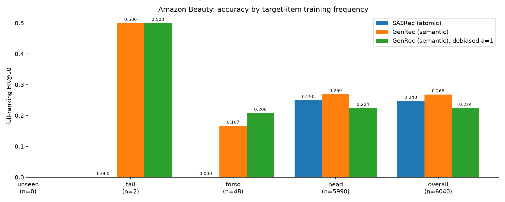

# Atomic vs. semantic IDs — MovieLens-1M, full ranking, test set

Buckets by the target item's training-split frequency (unseen: 0–0, tail: 1–4, torso: 5–19, head: 20+).
Both models rank exhaustively over the whole catalogue, so no beam approximation is
involved on either side. `debiased a=1` subtracts the log training-frequency prior.

| bucket | users | SASRec (atomic) HR@10 | GenRec (semantic) HR@10 | GenRec (semantic), debiased a=1 HR@10 | GenRec (semantic) vs SASRec (atomic) | GenRec (semantic), debiased a=1 vs SASRec (atomic) |
|---|---|---|---|---|---|---|
| unseen | 0 | nan | nan | nan | — | — |
| tail | 2 | 0.0000 | 0.5000 | 0.5000 | — | — |
| torso | 48 | 0.0000 | 0.1667 | 0.2083 | — | — |
| head | 5990 | 0.2496 | 0.2689 | 0.2244 | +7.8% | -10.1% |
| overall | 6040 | 0.2475 | 0.2682 | 0.2243 | +8.4% | -9.4% |

## Significance vs the atomic baseline

Fisher exact on hits/misses per bucket. `p(>)` is one-sided for the semantic model
being better (the cold-start prediction); `p(2)` is two-sided.

| bucket | users | model | hits@10 | baseline hits | p(>) | p(2) |
|---|---|---|---|---|---|---|
| tail | 2 | GenRec (semantic) | 1 | 0 | 0.5000 | 1.0000 |
| tail | 2 | GenRec (semantic), debiased a=1 | 1 | 0 | 0.5000 | 1.0000 |
| torso | 48 | GenRec (semantic) | 8 | 0 | 0.0028 | 0.0057 |
| torso | 48 | GenRec (semantic), debiased a=1 | 10 | 0 | 0.0006 | 0.0012 |
| head | 5990 | GenRec (semantic) | 1611 | 1495 | 0.0082 | 0.0165 |
| head | 5990 | GenRec (semantic), debiased a=1 | 1344 | 1495 | 0.9995 | 0.0013 |
| overall | 6040 | GenRec (semantic) | 1620 | 1495 | 0.0050 | 0.0099 |
| overall | 6040 | GenRec (semantic), debiased a=1 | 1355 | 1495 | 0.9987 | 0.0029 |

