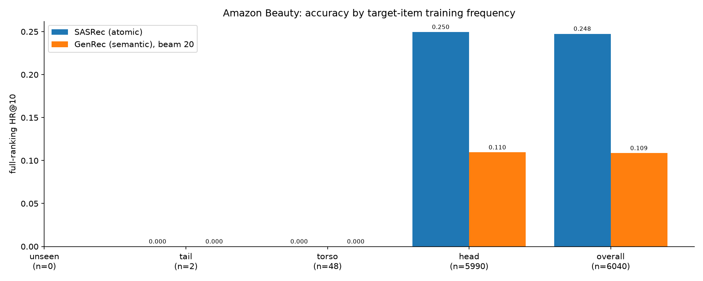

# Atomic vs. semantic IDs — MovieLens-1M, full ranking, test set

Buckets by the target item's training-split frequency (unseen: 0–0, tail: 1–4, torso: 5–19, head: 20+).
SASRec ranks exhaustively; GenRec is ranked by constrained beam search (beam=20), so a target the beam drops counts as a miss no matter how
the model scores it. These numbers are a beam approximation and are not
comparable to the exhaustive table.

| bucket | users | SASRec (atomic) HR@10 | GenRec (semantic), beam 20 HR@10 | GenRec (semantic), beam 20 vs SASRec (atomic) |
|---|---|---|---|---|
| unseen | 0 | nan | nan | — |
| tail | 2 | 0.0000 | 0.0000 | — |
| torso | 48 | 0.0000 | 0.0000 | — |
| head | 5990 | 0.2496 | 0.1095 | -56.1% |
| overall | 6040 | 0.2475 | 0.1086 | -56.1% |

## Significance vs the atomic baseline

Fisher exact on hits/misses per bucket. `p(>)` is one-sided for the semantic model
being better (the cold-start prediction); `p(2)` is two-sided.

| bucket | users | model | hits@10 | baseline hits | p(>) | p(2) |
|---|---|---|---|---|---|---|
| tail | 2 | GenRec (semantic), beam 20 | 0 | 0 | 1.0000 | 1.0000 |
| torso | 48 | GenRec (semantic), beam 20 | 0 | 0 | 1.0000 | 1.0000 |
| head | 5990 | GenRec (semantic), beam 20 | 656 | 1495 | 1.0000 | 0.0000 |
| overall | 6040 | GenRec (semantic), beam 20 | 656 | 1495 | 1.0000 | 0.0000 |

